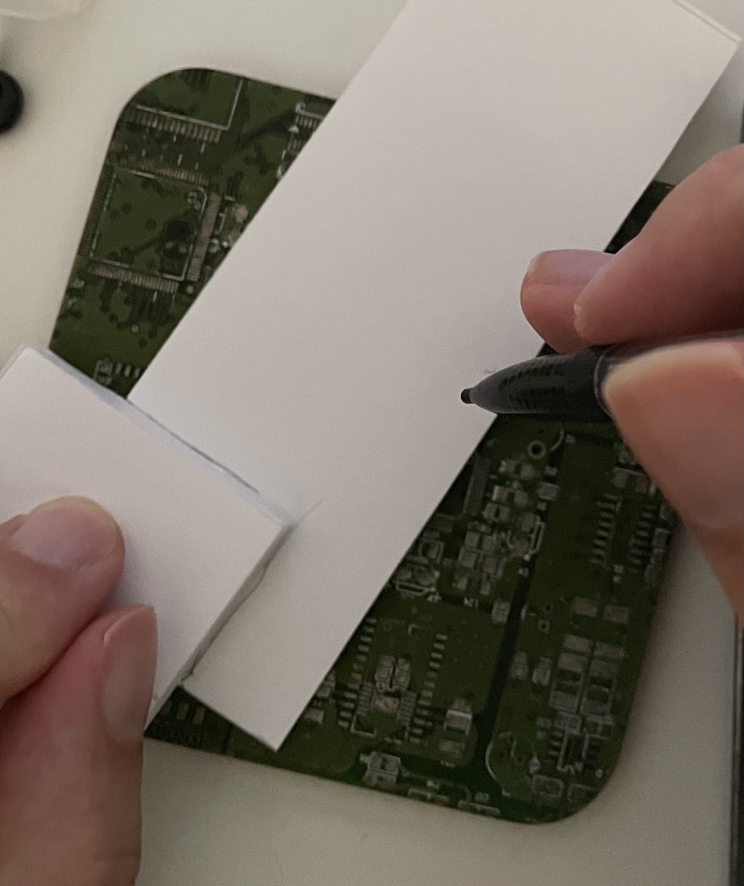
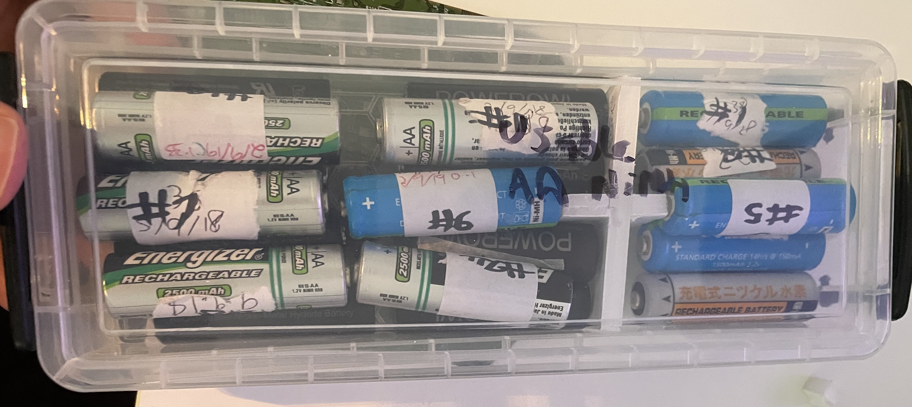

When I'm testing robots, I tend to use a lot of AA batteries. My preference is to use NiMH rechargeables. One issue is that the charger I have can only charge four, while some of my robots may use 12. So I have to charge them in batches. See [Why we are using AA batteries]() for why I use AA batteries when building robots.

This means I need a few ways to manage them. I also need to keep track of which batteries are in which robot, so I know where they are (and not leave them to rot in a robot I don't use for a while).

## Tracking the batteries

NiMH batteries also tend to degrade over time, so I need to keep track of when I last charged them and measure their voltage. If batteries don't seem to charge any more, I can then replace them.

First - I use a spreadsheet to manage these. Each battery gets a number,, I just use a marker pen to put a number against them, and then I can track them in the spreadsheet. I also have a column for the date I last charged them, and a column for the voltage. I can then sort by voltage, and see which batteries are getting low. I can also see which batteries I last charged, and when. I have a column for a 24 hour charge check (which I don't always remember to do).

I also note their brand and estimated purchase date. Those Jessops batteries have served me well!

## Storing the batteries

I then use some simple storage boxes to keep them in - currently using a Really Handy Brand box which has just the right dimensions for most, with a separate box for those waiting for a 24 hour test.

This box was storing only those that are charged, with a separate box for those needing charge. But since both these groups should fit in the same box, I can save a bit of space and make it easier to find the batteries I need. As the picture shows, this could sometimes be mostly empty if I've not been keeping up with the charges and tests.

I decided today to use foam board (which I've been finding a great material) to make a divider, and store both sets of batteries in it. Given that it's the same number of batteries (excusing those out in use), then a slidable divider would be ideal. But I don't have any of those, so I made a simple divider.

The plan was to measure out some foam board against the box, cut it, with another foam board strip slotted in to stop it falling over. I did this more as a quick hack so it's not perfect.

Step 1 - measure the box and cut the foam board to a strip. I had offcuts from my arena build that were perfect for this:

I made the main cut:

<table class="panel_images">
<tr>
<td></td>
<td></td>
</tr>
</table>

Step 2 - next I needed to make a slot, so I could put a stand in. Being a bit lazy with this one, I am using the foamboard scraps to mark and rule with.

<table class="panel_images">
<tr>
<td></td>
<td></td>
<td></td>
</tr>
</table>

Before I made these cuts, I also marked out the stand part in a similar way, using the original part as a reference:

<table class="panel_images">
<tr>
<td></td>
<td></td>
</tr>
</table>

Now I was ready to cut the slots and stand out:

<table class="panel_images">
<tr>
<td></td>
<td></td>
</tr>
</table>

I marked another slot in this stand, again, using the depth of the original slot as a guide:

<table class="panel_images">
<tr>
<td></td>
<td></td>
<td></td>
<td></td>
<td></td>
</tr>
</table>

Then I could cut this out:

<table class="panel_images">
<tr>
<td></td>
<td></td>
<td></td>
<td></td>
<td></td>
</tr>
</table>

And the main panel slot too:

<table class="panel_images">
<tr>
<td></td>
<td></td>
<td></td>
<td></td>
</tr>
</table>

These parts were easily slot together:

<table class="panel_images">
<tr>
<td></td>
<td></td>
</tr>
</table>

I tried this in the battery box and found a problem:

<table class="panel_images">
<tr>
<td></td>
<td></td>
</td>
</table>

As the second image shows, the part is too big. I need to cut it down a bit. Note that in the second image below, it was a little close to the slot. I also trimmed a bit from the "legs" of the stand too.

I marked the part with a pencil, and then cut it down with a craft knife:

<table class="panel_images">
<tr>
<td></td>
<td></td>
<td></td>
</tr>
<table>

This was ready for another try, and it fitted:

<table class="panel_images">
<tr>
<td></td>
<td></td>
</tr>
</table>

I am quite pleased with this result, and I've just gained a little more experience with foam board cutting. It was a bit cheeky - using my PCB cupholder as a cutting matt and the foam itself as a straight-enough edge to cut against. But it worked.
