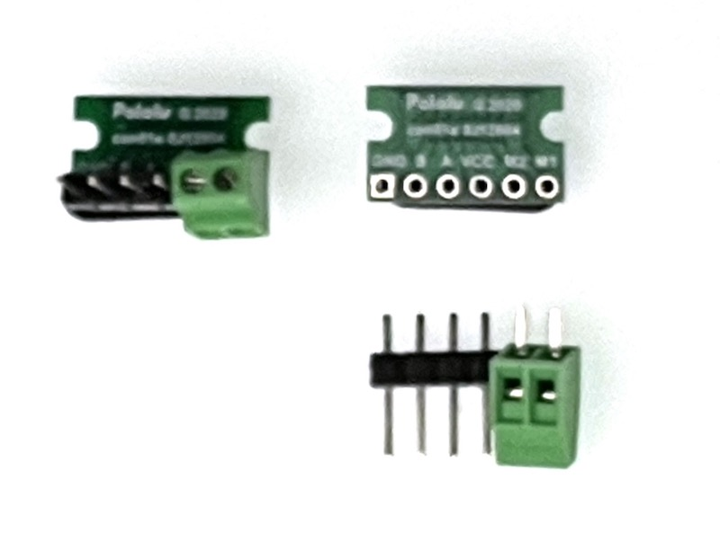
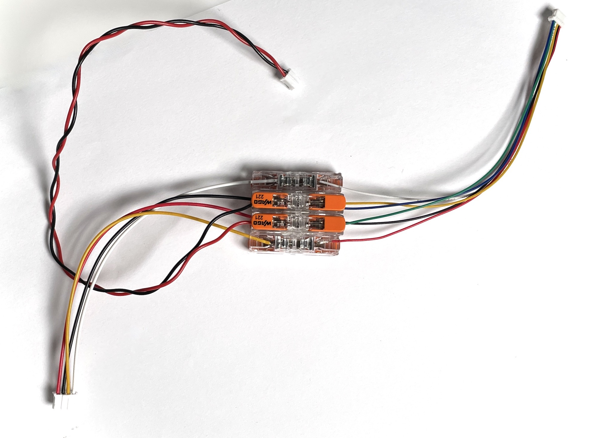
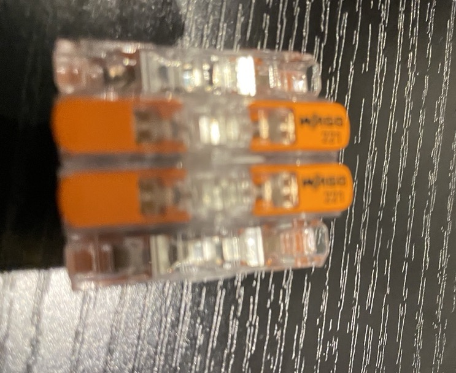

This weekend, while doing some research for an upcoming book project, and other robots, I had an interesting challenge.

I had the FIT0450 motors, great for working with chassis that want TT motors, but they come with magnetic encoders. I also had the awesome Pimoroni Inventor Hat Mini. However, there is a problem, they have incompatible connectors.

My usual go-to solution, which I did without really thinking about it, was to solder something - buy a PCB adaptor which accepted the 6 pin JST-SH at one end, which broke out for me to solder the pin headers and a screw terminal block at the other end. I've done this many times before. The solder job is a bit fiddly, and not that suitable for a beginner, pus screw terminals for motors come out.

I began to feel it was off when writing it up properly, and that if this is a first robot build, and a first solder job, it is actually pretty horrid, and can fail in many ways. So I went and spoke to friends, colleagues and social media. A plan began to form.

I had three options in mind:

1. Soldering, the thing I'd already done and photo'd. Sure a robot builder will probably need to learn to solder eventually.
2. Buying connector "pigtails" and splicing them with something.
3. Crimping their own endings.

## Evaluating the options

### Soldering

I am experienced with Soldering. I have an iron, a bunch of clamps and stands, an extractor to save my lungs, eye wear when I need it, a stand for the iron, solder tip cleaning stuff and so on.

A beginner will have none of this. They could go to a MakerSpace, which may have all of this. If they don't have access to one though, they will need to buy the gear. which for a starting job with 12 connections (2 x 6) feels like a lot of gear.

### Buying connector "pigtails" and splicing them with something

This I thought would be the quick and dirty beginners solution. PigTails are connectors with a short length of wire attached. You can buy them with a variety of connectors on the end. I have a bunch of them for my own projects. The wire is pre-stripped and ready to use.,

For the splice, you could solder splice, which defeats the point of this option, use chop-block or WAGO connectors.

This might end up untidy, and I was worried about chop-blocks coming loose, or introducing poor connections.

### Crimping their own endings

This option was to suggest readers buy cables, along with crimping tools, and crimps for the right type of connector, JST types, in this case.

Crimping is another skill like soldering, quite handy and can make tidy connections. However, the tools are either cheap and tricky to use, or expensive branded ones, and still tricky to use. With practice you can get good, but they are tiny and frustrating.

Worse, they can be subtly wrong, and start to pull out or make poor connections.

## Challenging my assumptions

Next, I started talking to people. The WAGO inline connector with the pigtails surfaced as a great option. Electricians often despise chop-blocks, and in automotive they are considered a no-go. When talking about the WAGO connectors, I asked if crimped and soldered connections were better.

I was informed that in aerospace, vehicles and battle robots, the WAGO 221 inline is considered less likely to come loose than a brittle solder joint, or a crimped joint that is slightly off. And is a preferred way to splice wires in both. I was shown images of inline connectors neatly tucked into a robot chassis, with a 3D printed bracket, and in cars used to join wires replacing older joints.

I was told how they are easy to connect, easy to change wiring on, and with the test spot, can help with diagnosis. My own assumptions were definitely challenged.

I was also surprised to see they can handle big currents and voltages, with 32a and 450v making my usual 3-12v at no more than 3 amps look tiny.

This is not necessarily as cheap as terminal pins, or crimps if you already have the tools and experience, but I was also surprised at these connectors being around £5 for 10 of them, or 50p each,and that is when not bought in bulk when they get cheaper.

When comparing them with chop block, or a screw terminal soldered into a PCB, there's almost no comparison, these make stronger connectors for a single strand or many strands of wire.

There's a downside that this will take up more space than the crimped wire or soldering connector adaptors, however, if I am looking to miniaturise a robot, I would look at motor mounts etc that are direct-to-PCB solder mounts and not use wires going between multiple connectors. They take up some size.

The other problem is that you end up with a handful of WAGO connectors, however, these are easily joined with some bluetac (which works surprisingly well), glue, 3d printed clips. WAGO makes clips for holding a bunch of these together, but I've not tried those yet.

WAGO connectors are designed for thicker wires, with those on pigtails being 0.5mm2, with the connectors intended for 1.4mm or thicker. Stripping twice the amount (22mm) and folding over might work here. I'll evaluate that as an approach.

A multi-way or miniature version of this inline connector would be nice though!

## Using them

After the initial conversations, I had a few days of trying this out and seeing the real world result.

For tiny pigtails, I did have to double up (fold over) wire ends, they are probably too fine a pitch for the WAGO 221. This meant stripping double.

I then had a wiring issue - and the WAGO's helped. First, the test points meant I could check each connection back to the WAGO. The problem turned out to be a wiring error (from a datasheet). Rewiring, or swapping these out for Dupont connectors to plug into an Arduino to simplify the problem, was easy. No soldering or crimping needed to change the wire order.

I tried some fairly aggressive shaking of the wires, and saw no fault. I don't recommend any connection is under stress, but I tried that and it looked good.

They still take a bunch of space, but making blocks of them with bluetac worked for me. It may be tidier if the pigtail connectors were ribbons, as they come as a set of 6 individual wires (or 4 depending on the connector size). However, once I am happy with the connections, I can always go around it with [Spiral Wire Wrap](2021/03/07/wire-wrap).

## Conclusion

I will be evaluating this WAGO 221 plus pigtail combinations in my future robots to make this kind of join, now I know how they can go from basic to really tidy. Every day is a school day.

This is going to help a number of robot builds, since wiring looms built this way take far less time than soldering or crimping, and will be more reliable.
