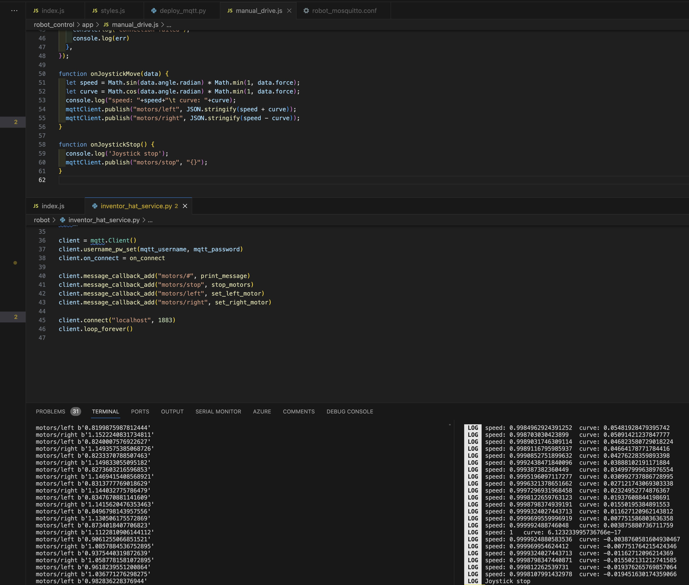

First off, I want to say a Happy New Year to all my readers. 2024 has started off as I'd like it to with some great things happening.

At the first hours of the year, I have some research come together with the Piwars robot building being controlled over MQTT from a phone app built using the Expo framework on react native. I'm new to the ecosystem, but have encountered react before in previous projects.

This is far more responsive than the HTTP thing I had before, and it's using the neat [react-native-joystick](https://www.npmjs.com/package/@korsolutions/react-native-joystick) library. What is even more awesome, is after I spotted some issues, spoke to the libraries author on github, and the project has been revived along with getting a load of fixes.

I've also integrated setting up Mosquitto on the Raspberry Pi with PyInfra, so this is all automated.

This code will be on GitHub when I am happy with it. It is also forming research for an upcoming book. I was excited to the point that I was giggling, rubbing my hands together and can't stop. I'm excited!

## Micro SD card issues

 I've been using the same robot to test some piwars code, and some code for an upcoming book. I need to find some good ways to label SD cards as they did get a little muddled up. Coloured sticky labels may be the answer.

## PiWars robot plans

Beyond the Piwars code, I've been solidifying the plans for the Yukon on the robot, mostly around code. The plan is to connect the Yukon to the Raspberry pi via USB, and have the Pi driving what it's doing. In which case, when PyInfra updates code on the robot, it will also use MPRemote to update the Yukon code.

## Book discount code

Going into the new year, there's a [promotional discount for eBook + AI Assistant access to my book Robotics at Home with Raspberry Pi Pico](https://packt.link/C08Du). Buying it now gets both for only $10 or £8! The Raspberry Pi Pico is a great way to get started with building, and programming your own robot. I've written the book around using CircuitPython, getting started with FreeCAD, building a robot, programming it with interesting behaviours like obstacle avoiding, orientation detection, driving specific distances and localising the robot in an arena!

