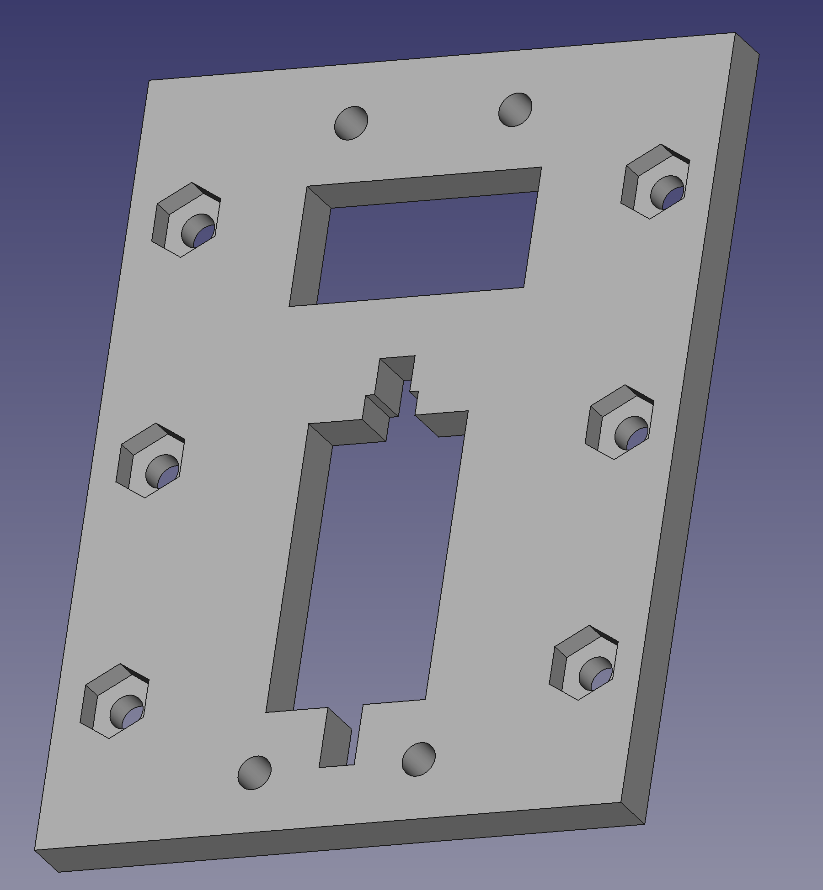
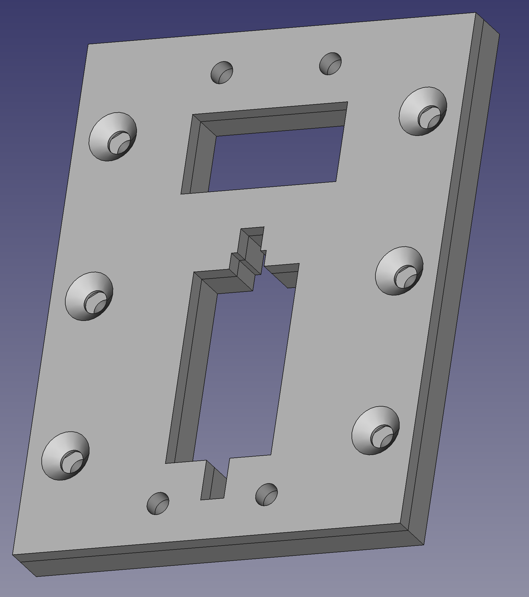

For my PiWars 2024 robot, and other robotics projects, I'll occasionally need the 3D printer. I don't use it for book robots as I'm aware that readers may not have access to a 3D printer, but for the PiWars robots, I like to get into more complicated stuff and use whatever I have at my disposal. With the largest limitation being time.

My printer has a few bad habits, stringing, lifting and warping in one corner, and a bti fo elephants foot. So last yar, while making a generic mount plate for my robots, I started tuning to get it into shape. This week I need a part with more stuff sticking out, and saw the stringing.

My current 3D printer is a FlashForge finder with a 10cm by 10cm build volume, which prints with PLA. No heated bed. I've had it for a few years, and while it's reliable in that I don't get failed prints, the stringing and warping started to bother me.



## Experiments tuning the mounting plate

The mounting plate is essentially a flat part, but needing to be precisely flat, with a few bolt holes, a slot for wires, and a slot for an SG90/MG90 servo motor. The idea is that I could mate attachments with it.

My student and I collaborated on it's design in FreeCAD. The concept is that the base plate has recessed holes for dropping nuts in, and would be embedded as part of a shell/hull structure for a robot. The cover plate drops over the nuts, keeping those captive, and the 6 countersunk side holes are for bolting this assembly down with the nuts.

The two holes top and bottom are for the attachment.

My attempts to 3D print this were frustrating, with warping, and elephants foot meaning that it was unusable. The nuts wouldn't fit, a servo wouldn't fit, and it was not straight. This started me on a path of trying to get the 3D printer dialed in far more.

My first tuning was to look at the bottom layers, if I can print them slower I give them more time to cool and solidify. This should keep them adhered to the bed, and reduce lifting. The numbers on these parts are the number of layers printed this way.



I cannot find the part for photos, but as I added more layers at a slower speed, it got better. However, something was definitely not right.

## Investigating stringing and retraction

This week, I was looking to £D print my github Skyline for 2023, a way for me to celebrate my open source contributions. However, my attempts at doing so lead to a stringy mess. Hmmm. So looking up stringing, and warping I started playing with retraction settings.



I found a great STL model for testing and tuning this at [Thingiverse Retraction test by deltapenguin](https://www.thingiverse.com/thing:909901). I was incrementing it for the first 4 builds, which was getting better.

However, at build 5, I reduced the temperature instead, for a dramatic change.

## Experimenting with temperature

It was at this point that I decided to print a temperature tower [Thingiverse Temp Tower](https://www.thingiverse.com/thing:2493504) and figure out how to use them. The interface for this in FlashPrint means added temperature overrides in a list. Annoyingly, you cannot edit items in the list, you must delete items and re-add them. It took me a while to figure out lining up the layers with the temperature changes, but I was able to use the layer preview with some calculations to figure it out.



With some observation, I determined that 195c was the best looking temperature for this filament. It took over an hour for this to print. But it was definitely worth  doing,and an experiment I will repeat with new filaments.

I then immediately tried reprinting the retraction test at 195 degrees c, however, this failed to stay adhered to the bed. Experiment 5.5 was a failure.



So I make a further setting, doing the bottom layer at 220 degrees, and the rest at 195 degrees. This was far better than any previous attempt.



Its still got some warping and lifting, so I will perhaps level the bed again, but there's significantly less stringing, or the ghost towers that come with it. I'm going to carry on tuning this as I'm certain I can get better results. I'm still very much learning with 3D printing, and I'm sure I'll get better at it.

I also want to try getting some nice filament, and printing out that GitHub skyline with it!
