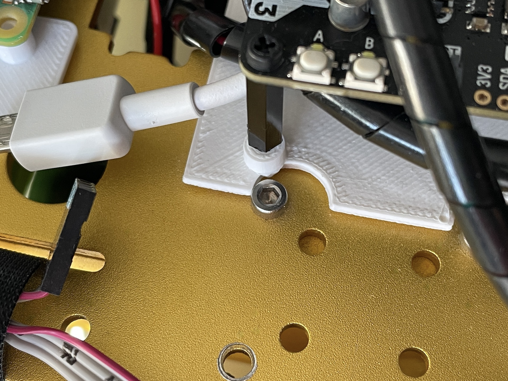
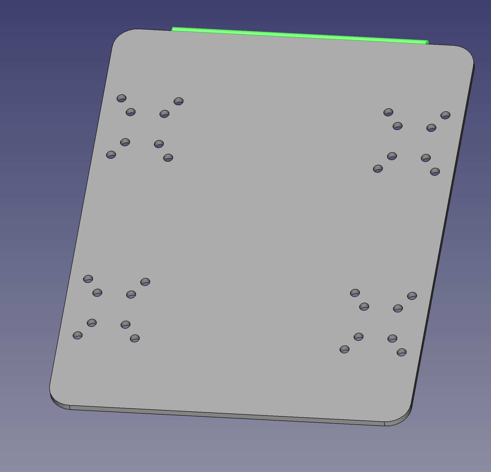
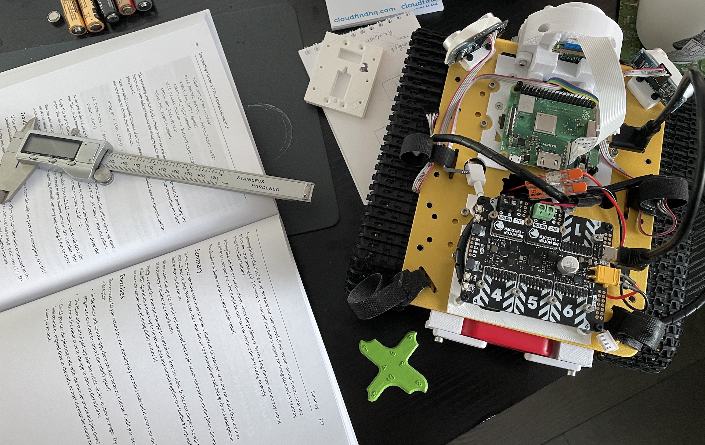

Our robot, Big Ole Yellow, originally built in 2019, is being re-purposed for the PiWars 2024 Disaster Zone competition.

The robot has a Raspberry Pi 3A+ as the main controller.

The main todo list for this are the tickets in our [Disaster Zone Github project](https://github.com/orionrobots/piwars_2024_disasterzone/issues), where we are tracking our progress and adding in problems or ideas as we go.

## Manual Driving

The robot can be driven manually using a Smart Phone App. The smart phone App uses MQTT over WiFi to control the robot.

Among our plans is to convert this to messages over BLE with a bridge, so we need no WiFi on the day.
We are happy with the motors and speed.

The motor controller are Big Motor modules on the Yukon, with a separate battery box for 2x18650 Lithium Ion cells for the motors. The Yukon means that voltage, current and temperature sensing for the motors is available.

The traction is ok, but we measures slopes and found that while it's great at 10 degrees, it will lose traction at 20 degrees. We are considering adding padding to the treads to improve this.

Todo list for improving manual driving:

- Bluetooth Low Energy (BLE) bridge for manual control.
- Add padding to the treads to improve traction on slopes.
- Making the App standalone (Currently needs a laptop to start).
- Get more drive time in.
- Make an obstacle course and see how we do with it.
- Use another robot of ours, to practice Pi Noon against! Lots of fun here! We should definitely get videos.

## Chassis and parts

The chassis CAD was originally in Fusion 360, with parts imported into FreeCAD for future proofing. However, when making the Yukon mounting plate, we found that some of the important holes for the chassis was off.

We have a universal mounting plate design, but are yet to integrate it into an upper hull design for the robot. We have a nerf gun turret printed, but need to mount that on the universal mount.

We have plans for a grab and lift mechanism, but need to design and print that.

There is a line following accessory, however, the mount for this doesn't work as expected. There's a similar problem with the headlights to go either side of the camera.

Todo list for improving the chassis and parts:

- Fix the CAD so holes align properly ont he chassis.
- Make the upper hull design and integrate the universal mount.
- Mount the nerf gun turret on the universal mount.
- Design and print the grab and lift mechanism.
- Fix the line following accessory mount.
- Fix the headlights mount.
- Start manual testing of the nerf gun.
- Start manual testing of the grab and lift mechanism.

## Test Areas

We have only flat floor, and simple slopes. However, we've built test areas before for other events.

We have plans for the following test areas:

- Lava Palava
- Blind Maze
- Eco Disaster
- Zombie tower
- Mine sweeping might be a bit trickier

## Sensors and Autonomy

We have a Pi Camera with a wide angle lens on board that is connected, along with the power and temperature sensors on the Yukon.

The chassis has distance sensors mounted for blind maze and Lava Palava, and we have three possible alternatives for line following, needing some chassis work. However, those are not electronically connected yet.

The motors have encoders but since switching to the Yukon, they will also be reconnected.

We are focusing right now on ensuring all the manual objectives will work, as a back up plan, and then turning our attention to sensors and autonomy after this. We have lots of autonomous code examples, from previous robots we've built that we can integrate, just hoping we find that time.

We have a spare Inertial Measurement Unit (IMU) and we may use those.

We need to consider how to autonomously deal with mine sweeping as our Camera currently faces forward.

For the zombie tower, we will start with assisted targetting, and then move to fully autonomous shooting.

We will be integration autonomous algorithms like:

- PID algorithms for line following in the Lava Palava.
- Simple conditionals plus camera colour masking for blind maze.
- Camera recognition, or at least green colour masking for the Zombie tower.
- Camera recognition plus some Monte Carlo localisation for the Eco Disaster. Not sure we'll need SLAM.

Todo list for improving sensors and autonomy:

- Connect the line following sensors.
- Reconnect the motor encoders.
- Connect and test the distance sensors.
- Test the Pi Camera and wide angle lens.
- Make the Lava Palava code and test it (we have prior code for this).
- Make the blind maze code and test it.
- Make the Eco Disaster code and test it.

## Repeatability and reliability

Our code is all in GitHub, and we are using a branch and merge git flow strategy, so we can work on different parts of the robot at the same time and so we can roll back to a last known working version if we break it.

We are using PyInfra to deploy code and configuration to the Raspberry Pi, so we can recover from a fresh SD Card, or roll back configuration changes like code too. This reduces the possibility of "I broke my code in the hotel room last night" problems.

The SD card is a deployment target, and is not the primary store of our code, so a dead SD card is not a disaster, merely a minor inconvenience.

We've spend time on mechanical reliability, but more thought on the electronic connection reliability could be taken. It is far less susceptible to vibration than the original design, but we need to make sure the connections are secure.

We need to figure out a carry case for the day, although a make-up case, with some tools and spares underneath, plus some foam, might be a good start.

## Overall status

We have a robot we can drive, with a few more tweaks to make that fully confident. We have a lot of work to do, but want to try and make sure the manual drive chain is reliable, even after a train journey to Cambridge.

Hopefully, by putting manual practice and components in place before autonomy, whilst we want to pick up the higher points in autonomy, we will aim to have something that will work on the day regardless.
